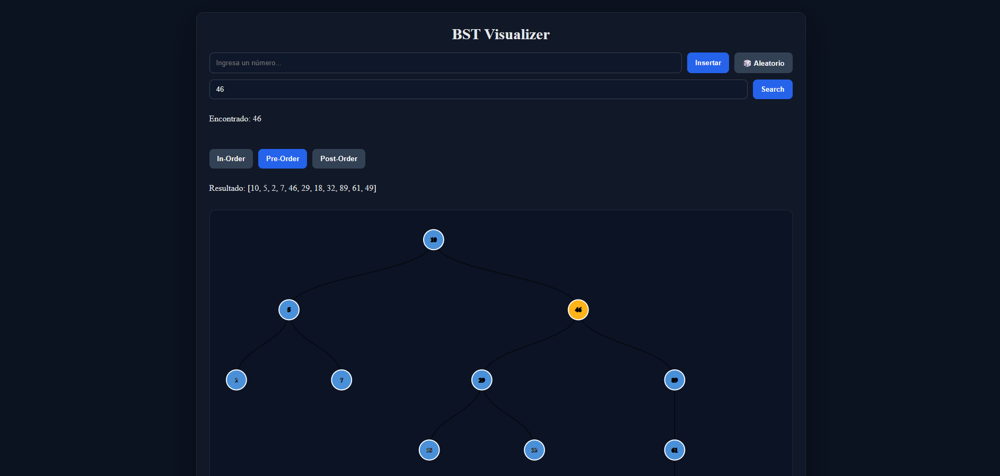

# BST Visualizer — Technical Challenge

> Herramientas de Empleabilidad · Prueba Técnica Práctica

---

## Datos del Estudiante

| Campo           | Valor                                                                                        |
| --------------- | -------------------------------------------------------------------------------------------- |
| **Nombre**      | Jorge Andres Marles Flórez                                                                   |
| **Código**      | 1152255                                                                                      |
| **Repositorio** | [github.com/JorgeMarles/bstree-assessment](https://github.com/JorgeMarles/bstree-assessment) |

---

## Demo en Video

> [Enlace al video en YouTube](https://youtu.be/LQgAls58iNU) (Se escucha un poco de estática durante los 3 primeros segundos del video únicamente)

---

## Captura de pantalla



---

## Stack Tecnológico

| Herramienta   | Uso                      |
| ------------- | ------------------------ |
| React 18      | Framework UI             |
| react-d3-tree | Visualización del árbol  |
| Vite          | Build tool               |
| Vitest        | Testing                  |
| CSS Modules   | Estilos (`*.module.css`) |

---

## Setup

```bash
npm install
npm run dev        # Servidor de desarrollo
npm run test       # Tests unitarios
npm run test:ui    # UI de Vitest en el navegador
```

---

## Ramas y Pull Requests

El proyecto se desarrolló en 4 ramas de feature, cada una con su respectivo Pull Request a `main`. A continuación se detalla el trabajo realizado en cada una.

---

### Rama 1: `feature/fix-insert-bug` — Corrección de Bugs (Nivel 1)

**PR:** [#1 — Feature/fix-insert-bug](https://github.com/JorgeMarles/bstree-assessment/pull/1) (MERGED)

**Qué se debía hacer:** Corregir los bugs #1, #2 y #3 en `src/utils/bst.js` que rompían la lógica de inserción y búsqueda del BST.

**Qué se hizo:**

| Bug    | Descripción                                                           | Corrección                                                                       |
| ------ | --------------------------------------------------------------------- | -------------------------------------------------------------------------------- |
| BUG #1 | `insert` siempre iba a la derecha                                     | Se agregó la condición `value < node.value` para descender al subárbol izquierdo |
| BUG #2 | Condición `value > node.value` duplicada (no existía la de izquierda) | Se reemplazó la segunda ocurrencia por `value < node.value`                      |
| BUG #3 | `search` usaba `==` (coerción de tipos)                               | Se cambió por `===` para garantizar igualdad estricta                            |

**Cómo se hizo:** Las correcciones en `insert` y `search` fueron implementadas manualmente por el autor. El agente de IA se usó únicamente para generar las descripciones de los commits con base en los cambios detectados en el diff.

**Commits:** 3 commits atómicos — `docs: add AGENTS.md`, `fix(bst): correct insert`, `fix(bst): use strict equality in search`.

---

### Rama 2: `feature/implement-traversal` — Implementación de Recorridos (Nivel 2)

**PR:** [#2 — Feature/implement-traversal](https://github.com/JorgeMarles/bstree-assessment/pull/2) (MERGED)

**Qué se debía hacer:** Implementar las funciones marcadas con `// TODO` en `src/utils/bst.js` y corregir el BUG #4 en `toD3Format`.

**Qué se hizo:**

| Función               | Implementación                                                                                                                                          |
| --------------------- | ------------------------------------------------------------------------------------------------------------------------------------------------------- |
| `inOrder(node)`       | Recorrido recursivo izquierda → raíz → derecha. Retorna `number[]` en orden ascendente.                                                                 |
| `preOrder(node)`      | Recorrido recursivo raíz → izquierda → derecha. Retorna `number[]`.                                                                                     |
| `postOrder(node)`     | Recorrido recursivo izquierda → derecha → raíz. Retorna `number[]`.                                                                                     |
| `getHeight(node)`     | Altura basada en nodos: árbol vacío retorna 0, un nodo retorna 1.                                                                                       |
| `toD3Format` (BUG #4) | Corrección: los hijos izquierdo y derecho ahora se procesan independientemente. Antes, cuando `left` era `null`, `right` era ignorado por un `else if`. |

**Tests:** Se reorganizaron los tests en `describe` por función y se agregaron ~35 casos cubriendo edge cases:

- `insert`: 5 tests (árbol vacío, duplicados, inserción balanceada)
- `search`: 3 tests (incluyendo type coercion con `===`)
- `inOrder`, `preOrder`, `postOrder`: 5 tests cada uno (nulo, un nodo, balanceado, left-skewed, right-skewed)
- `getHeight`: 6 tests (nulo, un nodo, balanceado, left-skewed, right-skewed, mixto)
- `toD3Format`: 8 tests (nulo, un nodo, ambos hijos, solo left, solo right, profundo, right-skewed, left-skewed)

**Verificación:** Insertar `10, 5, 15, 3, 7, 12, 20` produce el árbol correcto. Los 37 tests pasan.

**Cómo se hizo:** Todas las implementaciones de lógica BST (recorridos, `getHeight`, fix de `toD3Format`) fueron realizadas manualmente. El agente de IA generó los mensajes de commit y sugirió la estructura de tests con edge cases para cada función.

**Commits:** 4 commits atómicos — `feat(bst): implement getHeight and add traversal/height unit tests`, `feat(bst): implement in-order, pre-order, and post-order traversals`, `chore(bst): erase TODO comments`, `fix(bst): resolve toD3Format ignoring right-only child nodes`.

---

### Rama 3: `feature/node-highlight` — Features Visuales (Nivel 3)

**PR:** [#3 — Feature/node-highlight](https://github.com/JorgeMarles/bstree-assessment/pull/3) (MERGED)

**Qué se debía hacer:**

- Los nodos que coincidan con el resultado de búsqueda deben resaltarse visualmente.
- El campo de inserción debe mostrar un mensaje de error si el usuario ingresa un valor no numérico.
- Corregir BUG #6 (NaN aceptado silenciosamente).

**Qué se hizo:**

| Feature / Bug           | Implementación                                                                                                                                   |
| ----------------------- | ------------------------------------------------------------------------------------------------------------------------------------------------ |
| BUG #6 — NaN feedback   | `handleInsert` detecta `isNaN(parsed)`, asigna mensaje de error al estado `errorMessage` y limpia siempre `inputValue`.                          |
| Node highlight          | `renderCustomNode` cambia el `fill` del círculo a `#FFB31A` (ámbar) cuando `nodeDatum.name === String(foundNode)`. Color por defecto: `#4A90D9`. |
| Error message rendering | Se renderiza `<span className={styles.errorMessage}>` condicionalmente debajo de los botones cuando `errorMessage` no está vacío.                |

**Verificación:**

- Insertar `10, 5, 15, 3, 7, 12, 20` → árbol se visualiza correctamente
- Buscar `7` → nodo 7 se resalta en ámbar
- Insertar `"abc"` → se muestra mensaje: _"No digitaste un número, intenta nuevamente"_

**Cómo se hizo:** El autor implementó la lógica de detección de NaN en `handleInsert` y la lógica de resaltado en `renderCustomNode`. El agente de IA generó el bloque de renderizado condicional del `errorMessage` y el reformateo de imports/estados/JSX.

**Commits:** 3 commits atómicos — `feat(bstVisualizer): highlight node when found its data`, `feat(BSTVisualizer): show errorMessage when exists`, `feat(BSTVisualizer): fix BUG #6 show Error Message when submitted NaN`.

---

### Rama 4: `feature/performance-optimization` — Optimización de Rendimiento (Nivel 4)

**PR:** [#4 — Feature/performance-optimization](https://github.com/JorgeMarles/bstree-assessment/pull/4) (MERGED)

**Qué se debía hacer:** Identificar y corregir problemas de rendimiento usando los hooks correctos de React.

**Qué se hizo:**

| Optimización                    | Hook          | Justificación                                                                                                                                                                 |
| ------------------------------- | ------------- | ----------------------------------------------------------------------------------------------------------------------------------------------------------------------------- |
| `d3Data` memoizado              | `useMemo`     | `toD3Format(root)` solo se recalcula cuando `root` cambia. Antes se ejecutaba en cada render, incluso los disparados por `inputValue`, `searchTerm` o `foundNode`.            |
| `traversalResult` memoizado     | `useMemo`     | Resuelve BUG #5: el resultado del recorrido solo se recalcula cuando `root` o `activeTraversal` cambian. Elimina recomputaciones innecesarias.                                |
| `renderCustomNode` estabilizado | `useCallback` | La referencia a la función de render se mantiene estable entre renders a menos que `foundNode` cambie. Evita que react-d3-tree re-renderice todos los nodos innecesariamente. |

**Verificación:**

- Insertar `10, 5, 15, 3, 7, 12, 20` → el árbol se visualiza igual que antes
- Cambiar entre recorridos in-order/pre-order/post-order → sin re-renders espurios del árbol
- Buscar un nodo → solo se re-renderiza para aplicar el resaltado

**Cómo se hizo:** El autor implementó `useMemo` para `traversalResult`. El agente de IA sugirió `useMemo` para `d3Data` (implementado por el autor) y recomendó e implementó directamente `useCallback` para `renderCustomNode`, explicando el propósito de cada hook.

**Commits:** 3 commits atómicos — `feat(BSTVisualizer): Implemente useMemo for traversal generation`, `feat(BSTVisualizer): Implemente useMemo for d3data (ai-suggested)`, `perf(BSTVisualizer): memoize renderCustomNode with useCallback`.

---

## Resumen de Uso de Inteligencia Artificial

Durante el desarrollo de este proyecto se utilizaron agentes de IA como herramienta de apoyo. A continuación se resume el uso en cada etapa:

### Qué generó el agente

| Área            | Contribución del agente                                                                                                                                                                                                            |
| --------------- | ---------------------------------------------------------------------------------------------------------------------------------------------------------------------------------------------------------------------------------- |
| **Commits**     | Generó los mensajes de commit para los 4 PRs con base en los diffs detectados, siguiendo Conventional Commits (`fix:`, `feat:`, `perf:`, `chore:`). Además de generación de mensajes de PR y la actualización de este mismo README |
| **Tests**       | Sugirió la estructura de tests con edge cases para cada función BST (nulo, un nodo, balanceado, skewed). La implementación de los casos fue manual.                                                                                |
| **UI**          | Generó el bloque de renderizado condicional del mensaje de error (`errorMessage`) en `BSTVisualizer.jsx`.                                                                                                                          |
| **Performance** | Sugirió `useMemo` para `d3Data`. Recomendó e implementó `useCallback` para `renderCustomNode`, incluyendo la explicación de por qué estabiliza la referencia.                                                                      |

### Qué modificó el autor

| Área                        | Modificación del autor                                                                                                                                                |
| --------------------------- | --------------------------------------------------------------------------------------------------------------------------------------------------------------------- |
| **Lógica BST**              | Todas las funciones core de `bst.js` (`insert`, `search`, `inOrder`, `preOrder`, `postOrder`, `getHeight`, `toD3Format`) fueron implementadas/corregidas manualmente. |
| **NaN detection**           | La lógica de detección de `isNaN` en `handleInsert` fue implementada por el autor.                                                                                    |
| **Node highlight**          | La lógica de resaltado en `renderCustomNode` (comparación con `foundNode`) fue implementada por el autor.                                                             |
| **useMemo traversalResult** | Implementado manualmente por el autor para resolver BUG #5.                                                                                                           |
| **useMemo d3Data**          | Sugerido por el agente, implementado por el autor.                                                                                                                    |

### Qué se rechazó

**Nada.** Todas las contribuciones del agente fueron revisadas y resultaron correctas y alineadas con las convenciones del proyecto documentadas en `AGENTS.md`. En ningún caso el agente generó código de lógica algorítmica que requiriera corrección. El autor mantuvo control total sobre las funciones core del BST y la calidad del código.

### Conclusión

El agente de IA se utilizó como **asistente para tareas auxiliares** (mensajes de commit, sugerencias de estructura de tests, generación de bloques de UI repetitivos, recomendaciones de hooks de React). Toda la lógica algorítmica del BST y las decisiones de diseño fueron tomadas, implementadas y verificadas por el autor. Cada línea de código generada por IA fue auditada antes de ser incorporada.

---

## Flujo de Trabajo Git

```
main
├── feature/fix-insert-bug          → PR #1 (MERGED)
├── feature/implement-traversal     → PR #2 (MERGED)
├── feature/node-highlight          → PR #3 (MERGED)
└── feature/performance-optimization → PR #4 (MERGED)
```

Cada rama contiene commits atómicos con mensajes en formato [Conventional Commits](https://www.conventionalcommits.org/).

---

## Tests

El proyecto cuenta con **37 tests unitarios** ejecutados con Vitest, cubriendo todas las funciones exportadas de `bst.js` con edge cases.

```bash
npm run test       # Ejecutar tests en terminal
npm run test:ui    # UI de Vitest en el navegador
```

---

## Recursos

- [react-d3-tree docs](https://bkrem.github.io/react-d3-tree/)
- [Visualización de BST (referencia visual)](https://visualgo.net/en/bst)
- [React useMemo](https://react.dev/reference/react/useMemo)
- [React useCallback](https://react.dev/reference/react/useCallback)
- [Conventional Commits](https://www.conventionalcommits.org/)
